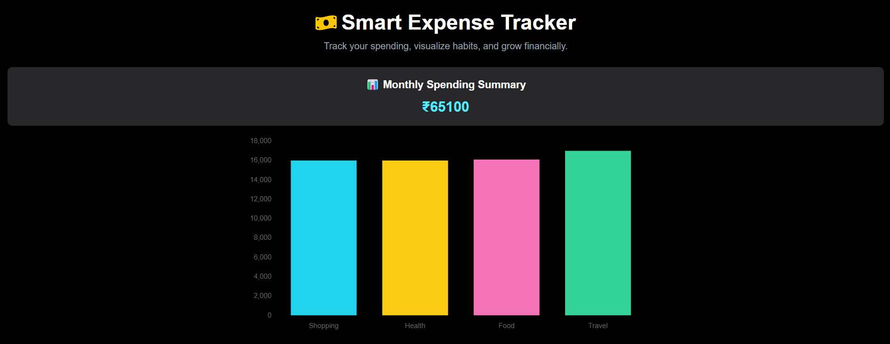

# 💸 Smart Expense Tracker

Track your spending, visualize habits, and grow financially — all in one modern and responsive expense tracker built with **React.js** and **Tailwind CSS**.

---

## 🔗 Links

- 🔥 Live Demo: [Smart Expense Tracker](https://smart-expense-tracker-rj.vercel.app/)
- 📦 GitHub Repo: [View Source Code](https://github.com/rajendra-jat7/SMART_EXPENSE_TRACKER.git)

---

## 🚀 Features

- 🎨 **Live Category Charts** using Canvas API
- 📍 **Auto Location Detection** using Geolocation API
- 📦 **Offline Handling** using Network Information API
- 💾 **Data Persistence** via `localStorage` (mimics Background Tasks API)
- 🔍 **Animated Tips Section** using Intersection Observer API
- 🧠 **Category-based Filtering** with instant chart & list update
- 📱 **Fully Responsive** – Works on desktop & mobile

---

## 🧪 How to Use

1. **Add New Expense**  
   ➤ Enter an amount  
   ➤ Select category (Travel, Food, Health, Shopping)  
   ➤ (Optional) Add a note  
   ➤ Location will be auto-fetched and attached

2. **View Live Chart**  
   ➤ Bar chart updates in real-time

3. **Filter by Category**  
   ➤ Click any category button to view relevant expenses

4. **Tips Section**  
   ➤ Scroll to view smart financial tips animated into view

---

## 🌐 APIs Used

| Web API                                                                                                 | Purpose                                    |
| ------------------------------------------------------------------------------------------------------- | ------------------------------------------ |
| [Canvas API](https://developer.mozilla.org/en-US/docs/Web/API/Canvas_API)                               | Renders dynamic bar chart for categories   |
| [Geolocation API](https://developer.mozilla.org/en-US/docs/Web/API/Geolocation_API)                     | Fetches user's location for expense tag    |
| [Intersection Observer API](https://developer.mozilla.org/en-US/docs/Web/API/Intersection_Observer_API) | Reveals smart tips on scroll               |
| [Network Info API](https://developer.mozilla.org/en-US/docs/Web/API/Network_Information_API)            | Displays warning when offline              |
| Background Task Behavior                                                                                | Simulated using `localStorage` persistence |

---

## 📸 Screenshots

### 💻 Dashboard View

### 📊 Bar Chart + Expense Entry

---

## 💡 Bonus Tips

- ☁️ Deploy using **[Vercel](https://vercel.com/)** or **[Netlify](https://netlify.com/)** – Free forever
- 🔥 Extend to use **Firebase Realtime Database** for syncing across devices
- 📤 Export expenses as `.csv` or `.json` (great for report generation)

---

## 🧠 Author

Made with ❤️ by **Rajendra Jat**  
📫 Connect on [LinkedIn](https://github.com/rajendra-jat7) | [GitHub](https://www.linkedin.com/in/rajendra-jat/)

---

## 🛠 Tech Stack

- **React.js**
- **Tailwind CSS**
- **Vite.js**
- **JavaScript Web APIs**

---

## 📌 License

This project is open-sourced under the [MIT License](LICENSE).

---
